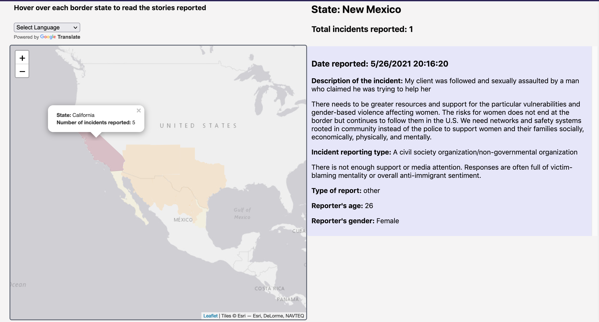

# Justicia Migratoria / Migration Justice
> Our project seeks to bring awareness to the human rights violations migrants and refugees endure while crossing the U.S./Mexico border.
> Live demo [_here_](https://annyrviloria.github.io/21S-ASIAAM-191A-GroupProject/index.html). <!-- If you have the project hosted somewhere, include the link here. -->

## Table of Contents
* [General Info](#general-information)
* [Technologies Used](#technologies-used)
* [Features](#features)
* [Screenshots](#screenshots)
* [Setup](#setup)
* [Usage](#usage)
* [Project Status](#project-status)
* [Room for Improvement](#room-for-improvement)
* [Acknowledgements](#acknowledgements)
* [Contact](#contact)
<!-- * [License](#license) -->

## General Information
Justicia Migratoria intends to:
- document incidents of violence experienced during migration
- uplift migrants' stories on their own terms
- bring visibility to the gap between documented/undocumented reports of violence against migrants
<!-- You don't have to answer all the questions - just the ones relevant to your project. -->

## Technologies Used
- Tech 1 - Javascript
- Tech 2 - CSS
- Tech 3 - Leatlet maps

## Features
By accessing our mapplication, users will be able to:
- Take our survey to report their experiences traveling to the US southern border
- Read about the experiences of other migrants and immigrant rights advocates
- Visualize how reports of violence are concentrated in different across the US border

## Screenshots

<!-- If you have screenshots you'd like to share, include them here. -->

## Setup
To run this project, simply open the link using an updated web browser. A google translate button in the top right of the page allows you to see the content and navigate the page in any language of your choosing. From the main page of the site, you can navigate to the project survey, which is available both in English and in Spanish.

## Usage
The mapplication is a cloropleth map of the border states in Mexico and the United States. By clicking on each of the states, users can see the state name and the total number of incidents reported. By hovering over each state, users can see the reports collected in a given state, organized from most recent to oldest. Visually, you can take a quick look at the states with more reports because these are colored red and states with fewest reports are colored light yellow.

Those interested in taking the survey can click on the buttons inside the description box. The survey is available in English and Spanish.

## Project Status
All the main features of the mapplication have been completed. We are now working to collect ideas for further improvement of the site based on tester's feedback.

## Room for Improvement

Room for improvement:
- It would be useful for viewers to be able to find stories similar to theirs, or to find incident reports according to demographics like age or gender.
- It would also be important to highlight the resources that migrants and legal advocates need access to.

To do:
- Sorting incident reports by non-geographical factors of interest, such as age or gender
- Adding a separate page or window of needed resources.

## Acknowledgements
This project was inspired by the [Stop AAPI Hate Map](http://www.hatecrimemap.com/covid). By emphasizing visibility of physical and verbal violence committed against migrants and refugees, we hope this project enourages all to reflect on the continuing struggles over land and belonging.

Many thanks to Albert Kochaphum for his guidance and mentorship.

## Contact
Created by Anny Rodriguez Viloria, Alize Magaña, and Andi Min

<!-- Optional -->
<!-- ## License -->
<!-- This project is open source and available under the [... License](). -->

<!-- You don't have to include all sections - just the one's relevant to your project -->
